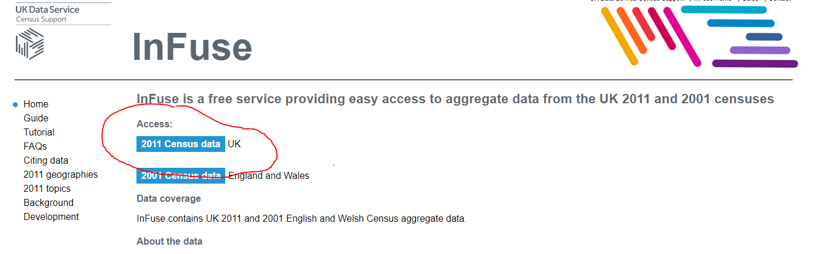
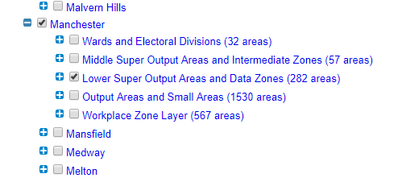
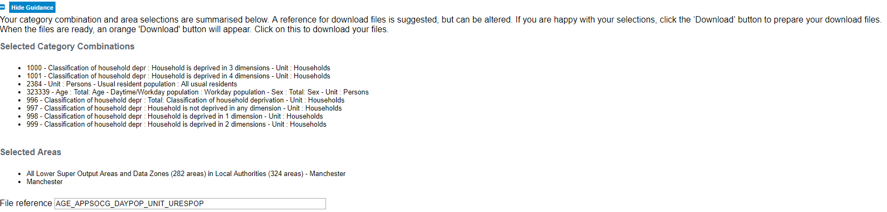
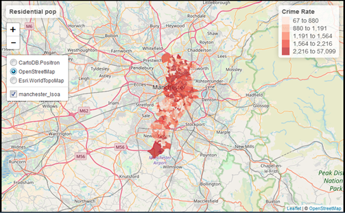

```{r setup, include=FALSE}
knitr::opts_chunk$set(echo = TRUE)
```


#Intro and recap

Last week we show you fairly quickly how to create maps of spatial point patterns using ggmap and we also introduced the tmap for thematic maps. Besides doing that we introduced a set of key concepts we hope you have continued studying over the week and discuss the sf package for storing spatial objects in R. This week we will carry on where we left the session last week. In the presentations last week we introduced varios kind of thematic maps and earlier today we discussed in detail issues with choropleth maps. So the focus of today's lab is going to be around thematic maps and some of the choices we discussed in our presentation last week and earlier today. We will also introduce faceting and small multiples, which is a format for comparing the geographical distribution of different social phenomena. For this session we will be using the spatial object that you created last week and complement it with additional information from the census. So first of all you will have to rerun the code you used to create the "manchester_lsoa" sf object. Apart from doing so, you want to start your session loading the libraries you know for sure you will need:

```{r, warnings=FALSE}
library(sf)
library(tmap)
library(dplyr)
```

You may not remember all of what you did to generate that file so let's not waste time and just cut and paste from below (but try to remember what each of the lines of code is doing and if you are not clear look at the notes from last week). Imagine you had to do all of this again by pointing and clicking in a graphical user interface rather than just sending the code to the console. As you will see time and time again, code in the end is a much more efficient way of talking to a computer.

```{r}
crimes <- read.csv("https://raw.githubusercontent.com/maczokni/2018_labs/master/data/2017-11-greater-manchester-street.csv")
#The following assumes you have a subdirectory called BoundaryData in your working directory, otherwise you will need to change to the pathfile where you store your LSOA shapefile
shp_name <- "BoundaryData/england_lsoa_2011.shp"
manchester_lsoa <- st_read(shp_name)
crimes_per_lsoa <- crimes %>%
  select(LSOA.code) %>%
  group_by(LSOA.code) %>%
  summarise(count=n())
manchester_lsoa <- left_join(manchester_lsoa, crimes_per_lsoa, by = c("code"="LSOA.code"))

```

You may not want to have to go through this process all the time. One thing you could do is to save the manchester_lsoa object as a physical file in your machine. You can use the st_write() function from the sf package to do this. If we want to write into a shapefile format we would do as shown below:

```{r, eval=FALSE}
st_write(manchester_lsoa, "BoundaryData/manchester_crime_lsoa.shp")
```

Notice how four files have appeared in your working directory, in your BoundaryData subdirectory. Remember what we said last week about shapefiles, there are a collection of files that need to be kept together.

If you wanted to bring this shapfile back into R at any future point, you would only need to use the st_read() function.

*Homework 1: What is different between manchester_lsoa.shp and manchester_crime_lsoa.shp?*

#Creating choropleth maps

The *tmap* package was developed to easily produce thematic maps. It is inspired by the ggplot2 packaged and the layered grammar of graphics (if you did the optional ggplot2 training this will make sense to you). It was written by Martjin Tennekes a Dutch data scientist. There are a number of [vignettes in the CRAN repository](https://cran.r-project.org/web/packages/tmap/index.html) that you can explore and the [GitHub repo for this package](https://github.com/mtennekes/tmap), GitHub is a collaborative website used by software developers and data scientist, also contains a useful readme section with additional resources to familiarise youself with this package. Each map can be plotted as a static map (*plot mode*) and shown interactively (*view mode*). We will start by focusing on static maps.

Every time you use this package you will need a line of code that specifies the spatial object you will be using. Although originally developed to handle sp objects only, it now also has support for sf objects. For this we pass the tm_shape() function and inside we specify the name of the spatial object we are using. On its own, this will do nothing. We need to add additional functions to specify what we are doing with that spatial object.

```{r, eval=FALSE}
tm_shape(manchester_lsoa)
```

The main plotting method consists of elements that we can add. The first element is the tm_shape specifying the spatial object, and then we can add a series of elements speficying layers in the visualisation. They can include polygons, symbols, polylines, raster, and text labels as base layers. Last week we saw how we could use tm_polygon to add polygons. Let's add such a layer:

```{r}
tm_shape(manchester_lsoa) + 
  tm_polygons()
```

Given that we are not passing any additional arguments all we are getting is a map with the shape of the geographies that we are representing, the census LSOAs for Manchester city. We can, however, ask R to produce a choropleth map by mapping the colour of the areas to a variable in our data table. In tmap we need to denote our variables between quotes. The first argument we pass then would be the name of the variable we want to visualise. If you remember we have a count for crimes ("count"), so let's do that.

```{r}
tm_shape(manchester_lsoa) + 
  tm_polygons("count")
```

Notice how this map is different from last week. What do you think the reason for this is? You may remember last week we used one additional argument *style* specifying the classification method we were going to use. If you remember we used quantiles. We will in a second look at how a map of the counts of crime looks different when we use different classification systems. But before we get to that, let's think about aesthetics a bit more. 

We have been using tm_polygons but we can also add the elements of a polygon map using different functions that break down what we represent here. In the map above you see the polygons hava a dual representation, the borders are represented by lines and the colour is mapped to the insety of the quantitative variable we are representing. Instead of using tm_polygon we can use the related functions tm_fil and tm_borders to denote these. Say we find the borders distracting. In that case we could just use tm_fill.

```{r}
tm_shape(manchester_lsoa) + 
  tm_fill("count")
```

As you can see here, the look is a bit cleaner. We don't need to get rid of the borders completely. Perhaps we want to make them a bit more translucent. We could do that by adding the border element but making the drawing of the borders less pronounced. 

```{r}
tm_shape(manchester_lsoa) + 
  tm_fill("count") +
  tm_borders(alpha = 0.1)
```

The alpha parameter controls the transparency of the borders, we can go from 0 (totally transparent) to 1 (not transparent). You can play around with this value and see the results.

Notice that the legend in this map is (a) not very informative and (b) located in a place that is less than optimal, since it covers part of the map. We can add a title within the tm_fill to clarify what count is and we can use the tm_layout() function to control the appearance of the legend. 

```{r}

tm_shape(manchester_lsoa) + 
  tm_fill("count", title = "Crime counts") +
  tm_borders(alpha = 0.1) +
  tm_layout(main.title = "Crime in Manchester City, Nov/2017", main.title.size = 0.7 ,
            legend.position = c("right", "bottom"), legend.title.size = 0.8)
#We are also going to change the current style of the maps by making them more friendly to colour blind people. We can use the tmap_style() function to do so.
current_style <- tmap_style("col_blind")

```

#Producing small multiples to compare the effect of different classification systems

For comparing the effects of using different methods we can use small multiples. Small multiples is simply a way of reproducing side by sides similar maps for comparative purposes. To be more precise small multiples are sets of charts of the same type, with the same scale, presented together at a small size and with minimal detail, usually in a grid of some kind. The term was at least popularized by Edward Tufte, appearing first in his *Visual Display of Quantitative Information* in 1983.

There are different ways of creating small multiples, some of which are quicker but a bit more restricted. Here we are going to use tmap_arrange(). With tmap_arrange first we need to create the maps we want and then arrange them togeter.

```{r}
#This will create a choropleth map using equal intervals as discussed earlier in the presentation
map1 <- tm_shape(manchester_lsoa) + 
  tm_fill("count", style="equal", title = "Equal") +
  tm_layout(legend.position = c("right", "bottom"), legend.title.size = 0.8,
            legend.text.size = 0.5)
#This uses the jenks method often preferred by geographers
map2 <- tm_shape(manchester_lsoa) + 
  tm_fill("count", style="jenks", title = "Jenks") +
  tm_layout(legend.position = c("right", "bottom"), legend.title.size = 0.8,
            legend.text.size = 0.5)
#This uses the quantile method often preferred by epidemiologists
map3 <- tm_shape(manchester_lsoa) + 
  tm_fill("count", style="quantile", title = "Quantile") +
  tm_layout(legend.position = c("right", "bottom"), legend.title.size = 0.8,
            legend.text.size = 0.5)
#This uses an unclassed choropleth map, it maps the values of our variable to a smooth gradient
map4 <- tm_shape(manchester_lsoa) + 
  tm_fill("count", style="cont", title = "Unclassed") +
  tm_borders(alpha=0.1) +
  tm_layout(legend.position = c("right", "bottom"), legend.title.size = 0.8,
            legend.text.size = 0.5)
#Notice we are not plotting the maps, we are storing them into R objects

#And now we deploy tmap_arrange to plot these maps together
tmap_arrange(map1, map2, map3, map4) 

```

*Homework 2: Discuss which of these classification methods gives you the best representation of crime in Manchester city*

#Using graduated symbols

The literature on thematic cartography highlights how counts are best represented using graduated symbols rather than choropleth maps. So let's try to go for a more appropriate representation. In tmap you can use tm_symbols for this. We will use tm_borders to provide some context.

```{r}
tm_shape(manchester_lsoa) + 
  tm_bubbles("count")
  
```

First thing you see is that we loose the context (provided by the polygon borders) that we had earlier. The border.lwd argument set to NA in the tm_symbols is asking R not to draw a border to the circles. Whereas tm_borders brings back a layer with the borders of the polygons representing the different LSOAs in Manchester city.

```{r}
tm_shape(manchester_lsoa) + 
  tm_bubbles("count", border.lwd=NA) +
  tm_borders(alpha=0.1) +
  tm_layout(legend.position = c("right", "bottom"), legend.title.size = 0.8,
            legend.text.size = 0.5)
```

#Bringing additional census data in

Last week you learn how to obtain crime data from the police UK website and you also develop the skills to obtain shapefiles with the boundaries for the UK census geographies. Specifically you learnt how to obtain LSOAs boundaries. Then we taught you how to join these data tables using dplyr. If you open your manchester_lsoa object you will see that at the moment you only have one field in this dataframe providing you with statistical information. However, there is a great deal of additional information that you could add to these data frame. Given that you are using census geographies you could add to it all kind of socio demographic variables available from the census. 

You may want to watch [this 4 minute video](https://www.youtube.com/watch?v=AzK04BOFd_s#t=17) to get a sense for how to obtain the data. If you don't have headphones make sure you read [this brief tutorial](http://infuse.ukdataservice.ac.uk/help/tutorial.html) before carrying on. We are going to get some data for Manchester city LSOAs. Let me warn you though, the census data portal is one of the closest things to hell you are going to come across on the internet. Using it will be a good reminder of wy point and click interfaces can suck the life out of you.  

From the main Infuse portal select the 2011 census data then when queried pick selection by geography:



Expand the local authorities and select Manchester. Expand Manchester and select LSOAs:



At the bottom of the page click in *Add* and then where it says *Next*. Now big tip. Do not press back in your browswer. If you need to navigate back once you get to that point use the *previous* button at the bottom of the screen. You will regret it if you don't do this. 

Now you will need to practice navigating the Infuse system to generate a data table that has a number of relevant fields we are going to use today. We will keep things fairly uncomplicated for the lab, but you will need to do a bit of extra work for the homework. For the lab I want you to create a file with information about: the resident population, the workday population, and the number of deprivation households. This will involve some trial and error but you should end up with a selection like the one below:



Once you have those fields click next to get the data and download the file. Unzip them and open the .csv file in Excel. If you view the data in Excel you will notice it is a bit untidy. The first row has no data but the labels for the variable names and the second row has the data for Manchester as a whole. We don't need those rows. Because this data is a bit untidy we are going to use read_csv from the readr package rather than the base read.csv function.

```{r}
#The name of the file may be slightly different in your case. 
library(readr)
census_lsoa_m <- read_csv("Data_AGE_APPSOCG_DAYPOP_UNIT_URESPOP.csv")
```

Notice that even all the variables that begin with f are numbers they have been read into R as characters. This is to do with the fact the first two lines do not represent cases and do have characters. R is coercing everything into character vectors. Let's clean this a bit.

First we will get rid of the first two rows. In particular we will use the slice() function from dplyr. We can use slice to select cases based on row number. We don't need the first two rows so we can select rows 3 to 284.

```{r}
census_lsoa_m <- slice(census_lsoa_m, 3:284)
```

There are also fields that we don't need. We only need the variables beginning with F for those have the information about population and deprivation, and the GEO_CODE tag which will allow us to link this table to the manchester_lsoa file.

```{r}

census_lsoa_m <- select(census_lsoa_m, GEO_CODE, F996:F323339)

```

We also want to convert the character variables into numeric ones, whilst preserving the id as a character variable. For this we will use the lapply function. This is a convenient function that will administer a function to the elements we pass as an argument. In this case we are asking to apply the as.numeric function to the columns 2 to 9 of the census_lsoa_m data frame.

```{r}

census_lsoa_m[2:9] <- lapply(census_lsoa_m[2:9], as.numeric)

```

The only problem we have now is that the variable names are not very informative. If you look at the metadata file that came along you can see that there is a key there to understand what these variables mean. We could use that information to create more meaningful names for the variables we have. We will use the rename() function from the dplyr package to do the renaming:

```{r}

census_lsoa_m <- rename(census_lsoa_m, tothouse = F996, notdepr = F997, depriv1 = F998,
                        depriv2 = F999, depriv3 = F1000, depriv4 = F1001, respop = F2384,
                        wkdpop = F323339)
```

Now that we have the file ready we can link it to our manchester_lsoa file using code we learnt last week.

```{r}
manchester_lsoa <- left_join(manchester_lsoa, census_lsoa_m, by = c("code"="GEO_CODE"))
```

And there you go... Now you have a datafile with quite a few pieces of additional information about LSOAs in Manchester. The next step is to use this information.

#Computing and mapping crime rates

Ok, so now have a field that provides us with the number of crimes and two alternative counts of population for each LSOA in Manchester. We could compute the rate of crime in each using the population counts as our denominator. Let's see how the maps may compare using these different denominators. But first we need to create new variables. For this we can use the mutate() function from the dplyr package. In this function, the first argument is the name of the data frame, and then we can pass as arguments all new variables we want to create. First we want to create a rate using the usual residents, since crime rates are often expresed by 100,000 inhabitants we will multiply the division of the number of crimes by the number of usual residents by 100,000. We will then create another variable, crimr2, using the workday population as the denominator. We will store this new variables in our existing manchester_lsoa dataset.

```{r}
manchester_lsoa <- mutate(manchester_lsoa, crimr1 = (count/respop)*100000, crimr2 = (count/wkdpop)*100000)
```

It should not be dificult for you to produce now a choropleth map like the one below. Clue: to change the colors for the fill of the polygons you can use the palette argument within the tm_fill calls. You can explore different palettes running the following code:

```{r, eval = FALSE}

tmaptools::palette_explorer()

```


*Homework 3: Reproduce the map below, you will need to include the code you used as part of your homework submission. Discuss the results. What are the most notable differences? Which denominator do you think is more appropriate (you will need to think about this quite carefully). Are you comparing like with like? Why? Why not? Could you make these comparisons more equivalent if you think you are not comparing like with like?* 


```{r, echo=FALSE}
map5 <- tm_shape(manchester_lsoa) + 
  tm_fill("crimr1", style="quantile", palette= "Reds", title = "Crime Rate") +
  tm_layout(panel.labels = "Residential pop", legend.position = c("right", "bottom"),
            legend.title.size = 0.8, legend.text.size = 0.5)

map6 <- tm_shape(manchester_lsoa) + 
  tm_fill("crimr2", style="quantile", palette="Reds", title = "Crime Rate") +
  tm_layout(panel.labels = "Workday pop", legend.position = c("right", "bottom"),
            legend.title.size = 0.8, legend.text.size = 0.5)

map7 <- tm_shape(manchester_lsoa) + 
  tm_fill("respop", style="quantile", palette="Blues", title = "Population") +
  tm_layout(panel.labels = "Residential pop", legend.position = c("right", "bottom"),
            legend.title.size = 0.8, legend.text.size = 0.5)

map8 <- tm_shape(manchester_lsoa) + 
  tm_fill("wkdpop", style="quantile", palette="Blues", title = "Population") +
  tm_borders(alpha=0.1) +
  tm_layout(panel.labels = "Workday pop", legend.position = c("right", "bottom"),
            legend.title.size = 0.8, legend.text.size = 0.5)

tmap_arrange(map5, map6, map7, map8) 

```

Once you have completed this activity, let's explore your map with the crime rate using the usual residents as the denominator using the interactive way. Assuming you name that visualisation map5 you could use the following code.

```{r}
tmap_mode("view")
map5
```

You may find it useful to shift to the OpenStreetMap by clicking in the box to the left, since it will give you a bit more contextual information than the default CartoDB basemap.



*Homework 4: What areas of the city seem to have the largest concentration of crime? Why? Does deprivation help you to understand the patterns? What's going on in the LSOA farthest to the South? Why does it look like a crime hotspot in this map and not in the one using the workday population?*

# More on small multiples and point pattern maps

Last week we showed you how to visualise point patterns using data from the Police UK website. One of the homeworks ask you to discuss the map you produced using ggmap in which you use type of crimes to colour your points. One of the problems with that map is that you had so many levels within that variable that it was very difficult to tell what was what. Even some of the colors in different categories were not that different from each other. That's a typical situation where faceting or using small multiples would have been a better solution.

You can use small multiples within the ggmap environment. Last week you learnt how to display the points using geom_point and passing a colour argument there. In order to represent each type of point in a separate map you add an additional call to facet_wrap where we will use the formula method (~) to indicate the variable we are using to identify each map. Essentially this will ask R to produce a map for each type of crime.

```{r, warning=FALSE}
library(ggmap)
UoM <- c(lon= -2.233885, lat= 53.466852)
mapUoM <- get_map(UoM, zoom = 15, scale= 1, source = "stamen", maptype = "toner")
ggmap(mapUoM, base_layer = ggplot(crimes, aes(Longitude, Latitude))) +
  geom_point(aes(colour = Crime.type), show.legend = FALSE) +
  facet_wrap(~Crime.type)
```

As you can see the results are a bit cluttered. And although ggmap is good for quick visualisations, it is fairly limited if you want to edit your final output. We can try to reproduce this with tmap. The crimes data frame is a standard data frame. We can plot it with ggmap but we won't be able to use it with packages that do require our data to be stored as a spatial object. So first we need to turn our data into a spatial object.

```{r}
#The st_as_sf will return a sf object using the geographical coordinates we specify, below you can see we also specify the coordinate system we are using

crime_sf <- st_as_sf(x = crimes, 
                        coords = c("Longitude", "Latitude"),
                        crs = "+proj=longlat +datum=WGS84")
#For a simple map with all the points
tm_shape(crime_sf) + 
  tm_dots() 
```

Since we didn't modify the tmap_mode we are still running on the view rather than the plot format. We can go back to the plot format with the following call.

```{r}
tmap_mode("plot")
```

Notice that unlike with ggmap that bounds the definition of the map around the centre of the provided coordinates and the given zoom level, here we are getting all the data points in the crime_sf object, which includes the whole of Greater Manchester. Also, since there are so many crimes, dots, it is hard to see patterns. We can add some transparency with the alpha argument as part of the tm_dots call.

```{r}
tm_shape(crime_sf) + 
  tm_dots(alpha=0.1) 
```

You can also use basemaps when working on the plot mode of tmap. We could for example use OpenStreet maps. We use the read_osm function from tmaptools package to do that, by passing crime_sf as an argument we will be bounding the scope of the basemap to the area covered by our point pattern of crimes. We will also need to load the OpenStreetMap for this to work. We will then add the basemap layer using the qtm function that is a function provided by tmap for quick plotting.

```{r}
library(tmaptools)
library(OpenStreetMap)
gm_osm <- read_osm(crime_sf)

qtm(gm_osm) + tm_shape(crime_sf) + 
  tm_dots(alpha=0.1) 
```

Let's zoom in into Manchester city, for which we can use our manchester_lsoa map.

```{r}
mc_osm <- read_osm(manchester_lsoa, type = "stamen-toner")

qtm(mc_osm) + tm_shape(crime_sf) + 
  tm_dots(alpha=0.1) 
```

If we want to recreate a bit closer to what we did with ggmap we can use the bb function from tmaptols to create a bounding box around the University of Manchester, the width and height parameters I am using determine the degree of zoom in (I got this from trial and error). Once you have this bounding box you can pass it as an argument to the read_osm function that will look for the basemap around that location. 

```{r}
UoM_bb <- bb("University of Manchester", width=.03, height=.02)
UoM_osm <- read_osm(UoM_bb, type = "stamen-toner")
qtm(UoM_osm)
```
Now that we have our basemap we can run our small multiples. Because we have a variable that determines the types we can use a different way to tmap_arrange explained above, we can essentially ask tmap to create a map for each of the levels in our organising variable (in this case Crime.type)

```{r}
qtm(UoM_osm) + tm_shape(crime_sf) + 
  tm_dots(size=0.5, col = "Crime.type") + 
  tm_facets("Crime.type", free.coords=FALSE) +
  tm_layout(legend.show=FALSE)
```

We could do some further tweaking around for ensuring things look a bit neater. But we have covered a lot of ground today, and you should all give yourself a congratulory "well done".
